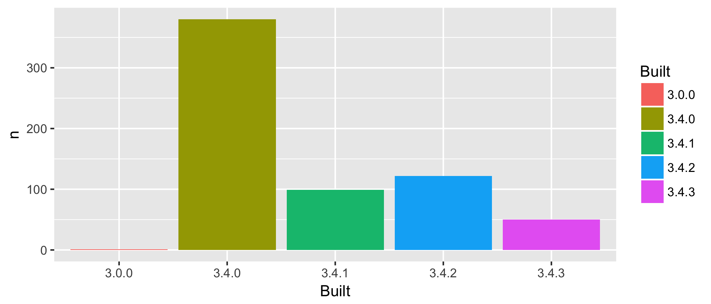

<!-- README.md is generated from README.Rmd. Please edit that file -->

```{r setup, include = FALSE}
knitr::opts_chunk$set(
  collapse = TRUE,
  comment = "#>"
)
library(tidyverse)
```

# packages-report

## Workshop challenge checklist

*As you complete tasks, you can ~~cross them out~~ by surrounding with `~~`.*

* ~~Have a look around the files here. Where are the R scripts? What are the directories `data` and `figs` for?~~
* ~~Notice that this README is an `.Rmd` file. That means it could contain R code and will need to be rendered to create `README.md`.~~
* ~~Open [R/01_write-installed-packages.R](R/01_write-installed-packages.R). Write the script as directed. Run it. Commit and push the current state.~~
* ~~Open [R/02_wrangle-packages.R](R/02_wrangle-packages.R). Fill in the missing pieces of the script as directed. Run it. Commit and push the current state.~~
* ~~Open [R/03_barchart-packages-built.R](R/03_barchart-packages-built.R). Fill in the missing pieces of the script as directed. Run it. Commit and push the current state.~~
* ~~Fill in the blanks below in this README, using the results stored elsewhere.~~
* If you get this far, write an R script to run the whole analysis and, perhaps, another script that does a `make clean` style reset.

## Overview

The goal of packages-report is to explore the packages that I have installed in my library.

```{r, include = FALSE}
freq <- readr::read_csv(here::here("data","add-on-packages-freqtable.csv"))
## load data/add-on-packages-freqtable.csv here in this chunk
```

I have `r nrow(freq)` add-on packages installed.

Here's how they break down in terms of which version of R they were built under, which is related to how recently they were updated on CRAN.

```{r, echo = FALSE}
knitr::kable(freq)
## print the frequency table here
## make it prettier if you know how
```



### Flow of the analysis

*If you have time, document the analysis works, using internal links.*

First we load our installed packages as a data frame in [01_write-installed-packages.R](R/01_write-installed-packages.R). We selected columns of interest and save the file to [data/installed-packages.csv](data/installed-packages.csv).

We are only interested in add-on packages beyond the base/recommended R packages, so in [R/02_wrangle-packages.R](R/02_wrangle-packages.R) we filtered out `Priority` base and recommend packages. I should have been able to do this using Library, since it seems most people have their base packages in a separate library, but I do not---everything is in one library. We then saved these add on packages and a frequency table of our add on packages to [data/add-on-packages.csv](data/add-on-packages.csv) and [data/add-on-packages.csv](data/add-on-packages-freqtable.csv).

Lastly, we made a barchart of the frequency of when the add on packages were built in [R/03_barchart-packages-built.R](R/03_barchart-packages-built.R). We saved this as a .png file in the (figs)[figs] directory. This can be seen in the "Overview" above.

